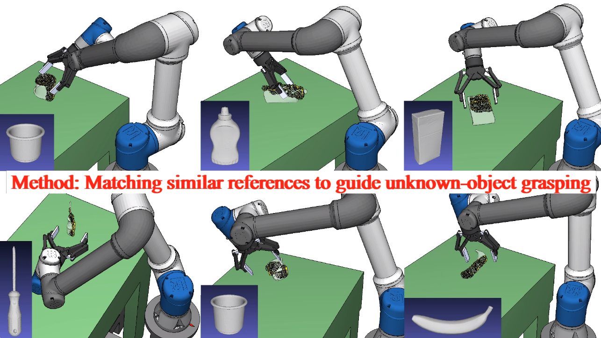

# Similarity-Based Object Grasping
This repository contains the source code for the T-RO paper **"A Multi-Level Similarity Approach for Single-View Object Grasping: Matching, Planning, and Fine-Tuning"**. The current implementation demonstrates the effectiveness of our method on single-object scenarios. The code can be extended to support cluttered scenes.  
[[Paper](https://arxiv.org/abs/2507.11938)] • [[Video](https://www.youtube.com/watch?v=dQw4w9WgXcQ)]
<br /> 
 
<br />

# Installation

## Environmental Configurations

(Test environment)  
Hardware: UR5e Robot Arm, Robotiq 2F-140 Gripper, RealSense Depth Camera D435  
Software: Ryzen 7 5800H CPU, GeForce RTX 3060 GPU  
OS: Ubuntu 20.04, Python 3.8, CUDA 11.6  

- Detic:
```
pip install torch==1.13.1+cu116 torchvision==0.14.1+cu116 torchaudio==0.13.1 --extra-index-url https://download.pytorch.org/whl/cu116
(Please refer to [Pytorch Installation](https://pytorch.org/get-started/previous-versions/) to find a suitable version)
cd detic/detectron2
pip install -e .
cd ..
pip install -r requirements.txt
mkdir models
wget https://dl.fbaipublicfiles.com/detic/Detic_LCOCOI21k_CLIP_SwinB_896b32_4x_ft4x_max-size.pth -O models/Detic_LCOCOI21k_CLIP_SwinB_896b32_4x_ft4x_max-size.pth 
```

- SAM:
```
cd ../sam 
wget https://dl.fbaipublicfiles.com/segment_anything/sam_vit_b_01ec64.pth
pip install -e .
```

- WRS:
```
cd ../wrs
pip install -r requirements.txt
```

- IKFast: (cannot be complied in virtual environment)
```
sudo apt-get install libblas-dev liblapack-dev python3-dev
cd ur_ikfast
pip install -e .
```

- Other packages:
```
pip install pyrealsense2==2.50.0.3812 ur_rtde pymeshlab
```

## Procedures

- Step 1: Set initial parameters<br><br>
Get your hand-eye calibration result as a 4x4 transformation matrix, including both rotation and translation components. Save the result to **configs/calibration.txt**.<br><br>
Manually set the robot's IP address to 192.168.0.X via the UR panel (Settings → System → Network). On your PC, set the IP address to 192.168.0.Y under (Settings → Network → Wired → IPv4) with a netmask of 255.255.255.0. Install the External Control URCap on the panel, and update **configs/robot_ip.txt** with the robot’s IP address (192.168.0.X).<br><br>
Configure a diagonally downward observation pose based on your operating environment. Save the corresponding joint angles to **configs/observation.txt**.<br><br>
In the **detic.sh** script, replace $YOUR_USER_PASSWORD with your own sudo password.

--------------------------------------------------

- Step 2: Capture background image and pre-load segmentation models<br><br>
Ensure the target object is not placed in the workplace, open a terminal and run
```
sh initialization.sh
```

--------------------------------------------------

- Step 3: Matching, planning, and fine-tuning<br><br>
Randomly place the target object in the workplace, open another terminal and run
```
sh start.sh
```

--------------------------------------------------

- For each trial, repeat steps 2 and 3.<br><br>


## Reference

If you find this project useful, please use the following BibTeX citation.

    @article{11079240,
  	title={A Multilevel Similarity Approach for Single-View Object Grasping: Matching, Planning, and Fine-Tuning},
  	author={Chen, Hao and Kiyokawa, Takuya and Hu, Zhengtao and Wan, Weiwei and Harada, Kensuke},
  	journal={IEEE Transactions on Robotics},
  	year={2025},
  	volume={41},
  	pages={500-519}
	}
